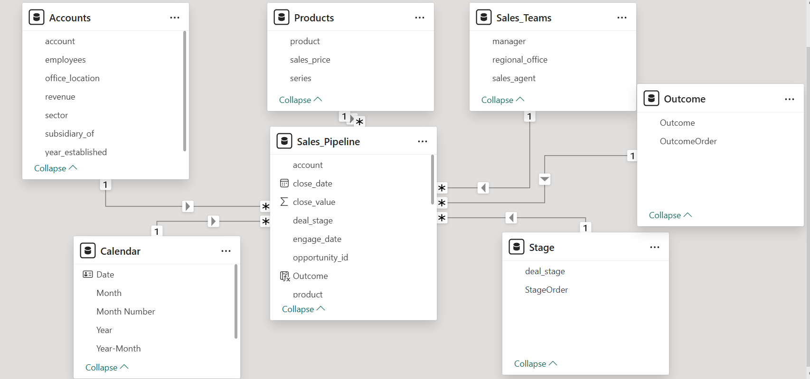

# Power BI CRM Pipeline Analysis

## Project Overview
An end-to-end Power BI solution analysing a multi-stage B2B sales pipeline using the Maven Analytics CRM dataset. This project demonstrates how raw CRM data can be transformed into a structured, enterprise-grade data model and executive-ready dashboard for pipeline monitoring, conversion analysis and performance evaluation.

**Key Focus:** Reusable BI framework with consistent metric definitions across reporting contexts.

## Business Context and Motivation

B2B sales teams frequently struggle with:
- **Limited visibility** into where opportunities drop off across pipeline stages  
- **Inconsistent metrics** across teams and reporting periods  
- **Surface-level analysis** focused on revenue rather than pipeline health  

This project replicates a realistic CRM analytics scenario, prioritising:
✓ Clear metric definitions  
✓ Time-intelligent calculations  
✓ Scalable data modelling

## Dataset

**Source**  
Maven Analytics CRM Sales Opportunities dataset
**Source:** [Maven Analytics CRM Sales Opportunities](https://www.mavenanalytics.io/data-playground)

| Attribute | Details |
|-----------|---------|
| Records | 8,000+ sales opportunities |
| Sectors | Multiple B2B industries |
| Time Span | 10/2016-12/2017 |
| Key Entities | Opportunities, Accounts, Products, Sales Teams, Time |

The dataset structure mirrors common enterprise CRM systems (Salesforce, HubSpot), making it suitable for simulating real-world BI workflows.

## Data Modelling Approach
### Data Model Diagram

The diagram below illustrates the star schema implemented in this project.

The central fact table captures individual sales opportunities, while surrounding dimension tables provide descriptive, organisational and temporal context. Progressive pipeline stages and closed outcomes are modelled as separate dimensions to avoid artificial funnel sequencing and ensure accurate conversion analysis.

## Data Preparation

Power Query was used to:

* Clean and standardise date and numeric fields
* Harmonise pipeline stage labels
* Distinguish open versus closed opportunities
* Prepare data for efficient DAX calculations

The focus was on analytical reliability rather than aggressive data manipulation.

## KPI Framework and DAX Measures
Metrics grouped by management priorities:

## KPI Framework and DAX Measures

Metrics are structured around core management priorities to ensure clarity, consistency, and decision relevance.

| Category | Key Metrics | Management Purpose |
|----------|------------|--------------------|
| **Scale** | Total Opportunities, Pipeline Value, Won Deals | Monitor pipeline size, revenue capacity, and growth potential |
| **Conversion Quality** | Win Rate, Stage Conversion Percentage | Evaluate sales effectiveness and qualification discipline |
| **Operational Efficiency** | Average Deal Cycle Time, Stage Duration | Identify bottlenecks and assess sales velocity |
| **Revenue Outcomes** | Total Won Value, Average Deal Size | Track realised performance and commercial impact |

All KPIs are implemented as DAX measures to ensure consistent aggregation across time periods, products, and sales agents. Measures are designed to be filter-aware and dynamically responsive to slicer selections, enabling both executive-level monitoring and granular drill-down analysis.

## Dashboard Deliverables
The Power BI report consists of multiple pages:

* Executive overview with KPI cards and overall pipeline health indicators
* Pipeline scale and structure analysis across stages and statuses
* Trend analysis by time period and business segment
* Conversion and funnel views to identify early stage and downstream bottlenecks
* Win rate performance and volatility analysis over time
* Deal cycle time and operational efficiency analysis
* Action oriented tables highlighting stalled, ageing or high impact opportunities

Screenshots of key pages are included in the repository for reference.

## Insights and Outcomes

The dashboard enables:

* Rapid assessment of pipeline health beyond surface level revenue
* Identification of stage specific drop offs and process inefficiencies
* Consistent interpretation of performance metrics across stakeholders

While based on a public dataset, the modelling logic and reporting structure reflect real world enterprise BI standards.

## Repository Contents

* Power BI report file (.pbix)
* Data model diagram
* DAX measures and KPI logic documentation
* Dashboard screenshots
* Executive insight summary

## Applicability

This analytical framework can be readily adapted to other pipeline based use cases, including recruitment funnels, credit approval processes and product conversion analysis.

## Technical Stack

- **BI Platform:** Power BI Desktop  
- **Data Transformation:** Power Query (M language)  
- **Calculations:** DAX (Data Analysis Expressions)  
- **Data Modelling:** Star schema with time intelligence  

## Potential Enhancements

- [ ] Predictive win probability modelling based on historical conversion patterns
- [ ] Role based row level security for team and manager level access
- [ ] Automated data refresh via API integration
- [ ] Extension to customer lifetime value and long term revenue analysis

## Contact

Questions or feedback? Feel free to reach out via [LinkedIn](https://www.linkedin.com/in/lunapang/) or open an issue in this repository.

---

*Built as a portfolio project to demonstrate end-to-end Power BI capabilities | Data: Maven Analytics CRM Dataset*
